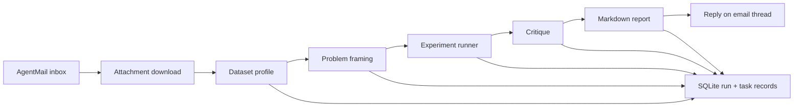

# Autonomous Data Team

Autonomous Data Team is an email-driven data science workflow that accepts dataset attachments, runs them through a small swarm of workers, and replies with findings and artifacts. The same codebase also includes the earlier `Data Is Plural` archive scorer so you can mine newsletter datasets when you are not analyzing a direct attachment.

The current implementation is local-first:

- AgentMail is the control plane for inbound requests and outbound replies
- SQLite stores runs, swarm tasks, archive entries, and scored opportunities
- deterministic Python code handles data loading, profiling, and model experiments
- CrewAI is optional and is used only for the coordinator, critic, and reporter reasoning steps

## Current capabilities

### Attachment-driven swarm

If an allowlisted sender emails a supported dataset attachment to `autonomous-data-team@agentmail.to`, the inbox worker will:

1. download the attachment
2. unpack `.zip` archives when they contain supported dataset files
3. profile the dataset
4. frame a modeling problem
5. run a small experiment slate
6. critique the results
7. write a report and reply on the same email thread

Supported attachment types:

- `.csv`
- `.tsv`
- `.json`
- `.parquet`
- `.zip` containing supported files

### Archive scoring mode

The codebase can also index the [`data-is-plural/newsletter-archive`](https://github.com/data-is-plural/newsletter-archive) repository, parse newsletter entries, probe dataset links, and rank them for likely usefulness, ML fitness, and storytelling value.

This mode is still present because it is useful for backlog discovery, but the primary product direction is now attachment analysis.

## Architecture

### Swarm workers

The attachment workflow is orchestrated as a sequence of workers recorded in SQLite:

- `acquisition`
  - saves email attachments locally
  - extracts supported files from zip archives
- `eda`
  - loads the dataset into a dataframe
  - computes schema, missingness, summaries, and target candidates
- `coordinator`
  - frames the problem and metric
  - uses CrewAI when enabled, otherwise heuristic logic
- `modeling`
  - runs deterministic experiments with `pandas` and `scikit-learn`
- `critic`
  - reviews whether the framing and experiment results are trustworthy
  - uses CrewAI when enabled, otherwise deterministic fallback text
- `reporting`
  - writes the final markdown report and email summary
  - uses CrewAI when enabled, otherwise deterministic fallback text

### Data flow



### Runtime behavior

- The modeling path is deterministic and local.
- CrewAI is optional. If it is disabled, unavailable, or its model call fails, the system falls back to deterministic framing, critique, and reporting.
- The inbox worker treats email as a trigger and transport mechanism, not as a compute substrate.

## Installation

Python `3.10+` is required.

### 1. Create a virtual environment

```bash
python3.10 -m venv .venv
```

### 2. Install the project

```bash
.venv/bin/pip install -e . pytest
```

### 3. Create your environment file

```bash
cp .env.example .env
```

## Configuration

The minimum runtime configuration for the attachment workflow is:

```env
OPENAI_API_KEY=
AGENTMAIL_API_KEY=
AGENTMAIL_INBOX_ID=autonomous-data-team@agentmail.to
AUTHORIZED_SENDERS=you@example.com
```

### Environment variables

| Variable | Required | Purpose |
| --- | --- | --- |
| `OPENAI_API_KEY` | optional | Used for CrewAI-backed coordinator, critic, and reporter steps. |
| `OPENAI_MODEL` | optional | Model name passed to CrewAI-backed reasoning steps. Defaults to `gpt-4.1-mini`. |
| `AGENTMAIL_API_KEY` | required for inbox mode | AgentMail API access for reading, labeling, downloading attachments, and replying. |
| `AGENTMAIL_INBOX_ID` | required for inbox mode | Inbox address or id to monitor. |
| `AUTHORIZED_SENDERS` | required for inbox mode | Comma-separated allowlist of permitted senders. |
| `ARCHIVE_CACHE_DIR` | optional | Local cache for the `Data Is Plural` archive repo. |
| `RUNS_DIR` | optional | Output directory for run artifacts and the default SQLite database. |
| `SAMPLE_DOWNLOAD_BYTES_LIMIT` | optional | Byte limit used by archive link probing. |
| `EXTRACTOR_PROVIDER` | optional | `none`, `browser`, `api`, or `tavily` for archive link extraction. |
| `EXTRACTOR_API_KEY` | optional | Generic extractor API key. |
| `EXTRACTOR_BASE_URL` | optional | Generic extractor base URL. |
| `EXTRACTOR_TIMEOUT_SECONDS` | optional | Timeout for extractor or probe requests. |
| `TAVILY_API_KEY` | optional | Tavily API key when `EXTRACTOR_PROVIDER=tavily`. |
| `TAVILY_EXTRACT_DEPTH` | optional | Tavily extract depth. Defaults to `advanced`. |
| `SWARM_ORCHESTRATOR` | optional | `crewai` or `heuristic`. Defaults to `crewai`. |
| `CREWAI_HOME_DIR` | optional | Repo-local home for CrewAI state. Defaults to `./runs/.crewai_home`. |
| `MAX_DATASET_ROWS` | optional | Row cap for local dataset loading during profiling and experiments. |
| `DB_PATH` | optional | SQLite database path. Defaults to `runs/opportunities.sqlite3`. |
| `RECENT_DEFAULT_COUNT` | optional | Default archive window for recent scoring. |

### Recommended defaults

- Use `SWARM_ORCHESTRATOR=crewai` if the machine has normal outbound access to the OpenAI API.
- Use `SWARM_ORCHESTRATOR=heuristic` when running in a network-restricted environment.
- Leave `EXTRACTOR_PROVIDER=none` unless archive link extraction is a real bottleneck.

## CLI

The package installs a single CLI:

```bash
autonomous-data-team
```

### Analyze a local dataset

This is the fastest way to validate the swarm without touching your inbox.

```bash
autonomous-data-team analyze-dataset \
  --path tests/fixtures/data/sample.csv \
  --notes "Prioritize interpretable models."
```

Output:

- a JSON object with `run_id`, `summary_path`, and `report_path`
- artifacts written under `runs/<run_id>/`

### Process the inbox once

```bash
autonomous-data-team inbox-worker --once
```

This:

- fetches unread messages
- rejects unauthorized senders
- runs the attachment workflow if a supported dataset attachment is present
- otherwise falls back to archive command parsing
- replies on-thread and updates labels

### Run the inbox worker continuously

```bash
autonomous-data-team inbox-worker --poll-interval 300
```

### Sync the archive

```bash
autonomous-data-team sync-archive
```

### Score the full archive

```bash
autonomous-data-team score-archive --mode full
```

### Score a recent archive window

```bash
autonomous-data-team score-archive --mode recent --limit 25
```

### Score one edition

```bash
autonomous-data-team score-edition --date 2025-08-27
```

### Show the top scored opportunities

```bash
autonomous-data-team top-opportunities --limit 20
```

## Inbox behavior

### Attachment path

If a message contains a supported non-inline attachment, the inbox worker prioritizes attachment analysis over archive commands.

Expected behavior:

- unread message is relabeled to `processing`
- the swarm runs on the attached dataset
- the worker replies with a short summary
- a markdown summary is attached to the reply
- the message is relabeled to `processed`

If attachment processing fails:

- the worker replies with the failure text
- the message is relabeled to `failed`

### Archive command path

If the message does not include a supported attachment, the worker parses the body for one of these commands:

- `RUN FULL ARCHIVE`
- `RUN RECENT <N>`
- `RUN EDITION <YYYY-MM-DD>`
- `TOP <N>`

## Artifacts

### Attachment runs

Attachment analysis writes a run directory under `runs/<run_id>/`.

Typical layout:

```text
runs/<run_id>/
  attachment_swarm_summary.md
  attachments/
    original_file.csv
  <dataset_name>/
    profile.json
    problem_frame.json
    experiment_result.json
    critique.json
    report.md
```

### SQLite

The default database is:

```text
runs/opportunities.sqlite3
```

Important tables:

- `runs`
- `swarm_tasks`
- `run_artifacts`
- `editions`
- `dataset_entries`
- `opportunity_scores`

## Modeling approach

The modeling worker is intentionally simple and local-first.

### Current supervised models

- classification
  - `DummyClassifier`
  - `LogisticRegression`
  - `RandomForestClassifier`
- regression
  - `DummyRegressor`
  - `Ridge`
  - `RandomForestRegressor`

### Current unsupervised fallback

- `KMeans` with silhouette score
- descriptive-only fallback when the dataset is too small for clustering

### Current preprocessing

- median imputation and scaling for numeric columns
- most-frequent imputation and one-hot encoding for categorical columns

## CrewAI integration

CrewAI is used narrowly:

- coordinator
- critic
- reporter

It is not used to execute the actual dataframe or model code.

This split is intentional:

- it keeps the experiment runner reproducible
- it avoids relying on agent-generated code for core ML execution
- it lets the system degrade gracefully when model calls fail

The project forces CrewAI to use a repo-local home directory and disables tracing/telemetry prompts so the inbox worker can stay non-interactive.

## Archive mode details

Archive mode is the older entry point but still supported.

It can:

- clone or refresh the `Data Is Plural` archive
- parse editions into structured dataset entries
- probe direct-download assets
- use extractors such as Tavily when configured
- score opportunities for downstream analysis

This mode is useful when you want a ranked queue of candidate datasets before anyone emails one in.

## Development

### Run tests

```bash
.venv/bin/pytest -q
```

### Useful local smoke tests

Deterministic fallback mode:

```bash
SWARM_ORCHESTRATOR=heuristic \
.venv/bin/autonomous-data-team analyze-dataset \
  --path tests/fixtures/data/sample.csv \
  --notes "Prioritize interpretable models."
```

CrewAI-enabled mode:

```bash
SWARM_ORCHESTRATOR=crewai \
.venv/bin/autonomous-data-team analyze-dataset \
  --path tests/fixtures/data/sample.csv \
  --notes "Prioritize interpretable models."
```

## Limitations

- The swarm currently processes workers sequentially rather than in parallel.
- The modeling slate is intentionally small and does not yet include hyperparameter search.
- Email attachments are assumed to be directly loadable tabular data.
- Archive scoring and attachment analysis still share one repository and one SQLite database.
- CrewAI-backed reasoning depends on outbound access to the configured model endpoint.

## Roadmap direction

The current structure is ready for the next step if you want it:

- true concurrent worker execution
- richer artifact generation such as plots
- MLFlow or equivalent experiment tracking
- larger-file ingestion strategy
- stronger dataset type handling such as time series or text-specific paths
